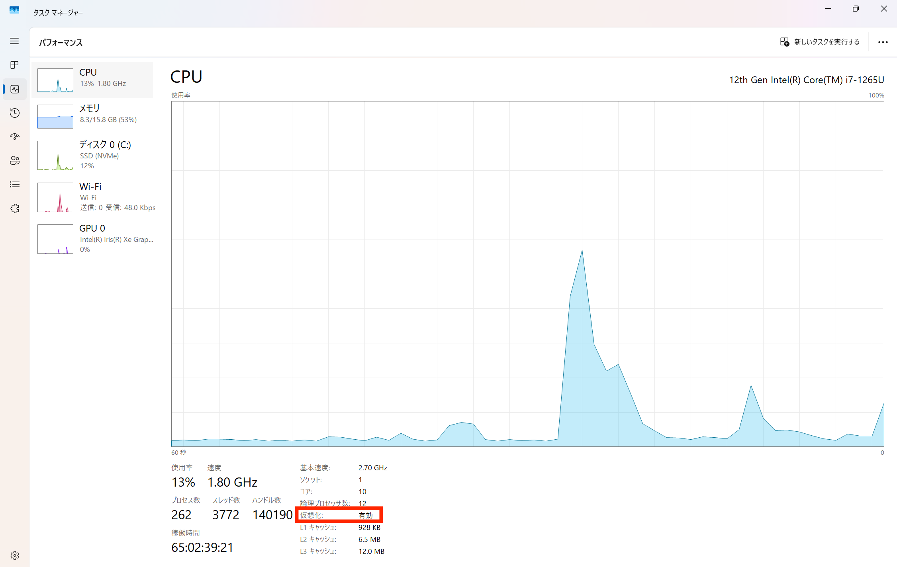
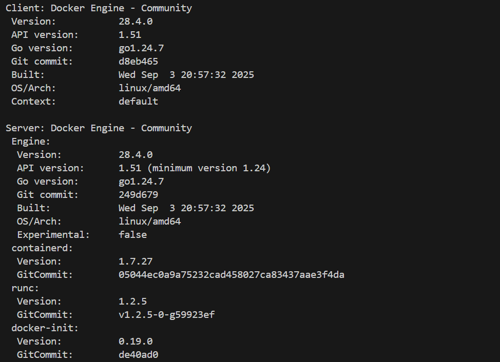

# Ubuntu（WSL2）セットアップマニュアル（Windows用）

このドキュメントでは、**Windows上でUbuntu（WSL2）をセットアップし、Dockerを使える状態にする**までの手順を説明します。

---

## 0. 仮想化機能の確認と有効化

### ① 仮想化機能とは？
WSL2 や Docker は、**仮想化技術（Virtualization）** を使って動作します。  
そのため、パソコンの設定で「仮想化」が有効になっている必要があります。

---

### ② 有効になっているか確認する
以下の手順で、仮想化機能が有効か確認します。

1. **Ctrl + Shift + Esc** を押して「タスクマネージャー」を開く  
2. 上部の「**パフォーマンス**」タブをクリック  
3. 左側のリストから「**CPU**」を選択  
4. 右側の情報欄の下部に「**仮想化：有効**」または「**仮想化：無効**」と表示されます  

**下のスクリーンショットを参考に確認してください**  


 **仮想化：有効** → そのまま次のステップへ  
 **仮想化：無効** または 表示がない → BIOS（UEFI）で有効化が必要です  

---

### ③ 仮想化を有効にする（表示が「無効」だった場合）

下記のリンクを参考にBIOSを起動して仮想化を有効にしてください。
[https://shop.applied-net.co.jp/blog/cate_kojin_news_tech/38802/](https://shop.applied-net.co.jp/blog/cate_kojin_news_tech/38802/)

再起動後に再度タスクマネージャーで「仮想化：有効」となっていればOKです 

---

## 1. Windows側で WSL を有効にする

仮想化が有効でも、Windows自体にWSL（Linuxを動かす仕組み）がオフだと起動できません。  
この手順では、**WSL機能と仮想マシンプラットフォームをオンにします。**

---

### ① Windows の機能を有効化する
1. スタートメニューで「**Windowsの機能の有効化または無効化**」を検索して開く  
2. **Linux 用 Windows サブシステム** にチェックをいれる
3. 「OK」を押して設定を反映  
4. Windowsの再起動を求められたら、再起動します  

---

### ② PowerShellで WSL の設定を確認

1. **スタートメニュー** → 「PowerShell」を右クリック → **管理者として実行**  
2. 次のコマンドを入力してWSLが有効か確認します：

```powershell
wsl --status
```

3. 結果に「**Default Version: 2**」または「**規定のバージョン: 2**」などが表示されていればOK  

もし `Default Version: 1` の場合は、次のコマンドを実行します：

```powershell
wsl --set-default-version 2
```

---

## 2. Ubuntuの初回セットアップ

1. 黒い画面（ターミナル）が開き、「Installing...」と表示されます  
   → 数分待ちます  
2. 次にユーザー名とパスワードを聞かれます：

   ```
   Enter new UNIX username:
   ```
   → 任意の名前を入力（例：student）  

   ```
   Enter new UNIX password:
   ```
   → パスワードを入力（入力中は表示されません）

3. 再入力後、次のように出たら完了です：
   ```
   Welcome to Ubuntu
   ```

---

## 3. Dockerとの連携確認

UbuntuでDockerコマンドが使えるか確認します。

1. **Docker Desktop**（Windows側）を起動しておく  
2. Ubuntuで次のコマンドを入力：

```bash
docker version
```

下記のように表示されればOKです：

📷 **確認結果の例**  


---

## 4. よくあるトラブルと解決方法

| 症状 | 主な原因 | 対処法 |
|------|-----------|--------|
| `docker: command not found` | Docker Desktopが起動していない | Dockerを起動して再実行 |
| Ubuntuが起動しない | 仮想化機能がオフ | BIOSで有効にして再起動 |
| `WSL 2 requires Virtual Machine Platform` | Windowsの機能がオフ | 「Virtual Machine Platform」を有効化 |
| 文字化けする | ロケール未設定 | `sudo apt install language-pack-ja` を実行 |
| 起動が遅い | WSL1で動いている | `wsl --set-version Ubuntu-22.04 2` を実行してWSL2に変更 |

---

## 完了！

これでUbuntu（WSL2）のセットアップが完了しました！  
次は、配布資料にある [アプリケーションのセットアップ](./01_setup.md) に進みましょう。
